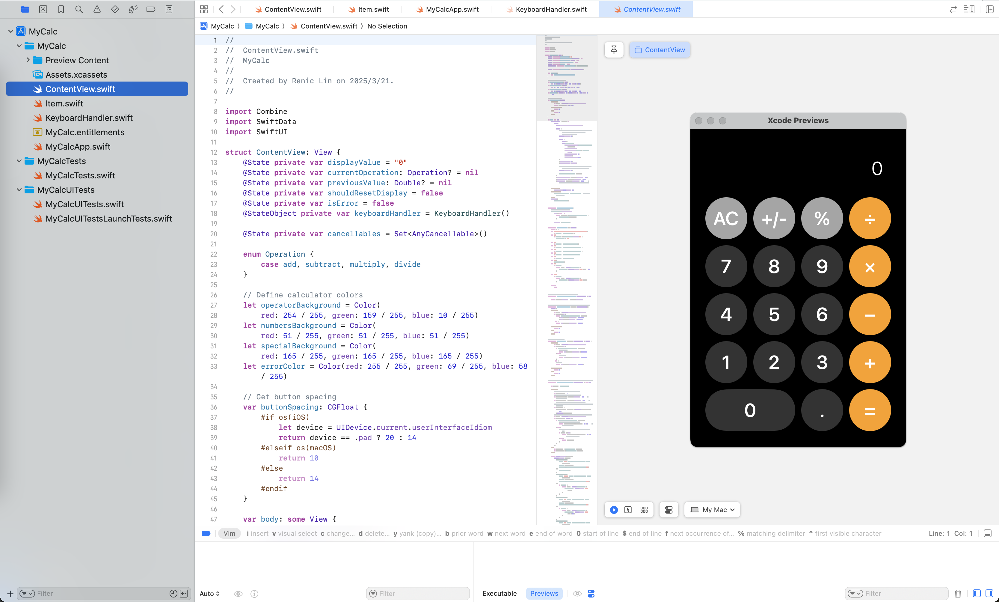

# MyCalc - SwiftUI Calculator Practice

A personal practice project to recreate Apple's calculator using SwiftUI. This project serves as a learning exercise to understand SwiftUI development across iOS, iPadOS, and macOS platforms.

## Learning Purpose

This project was created to:
- Practice SwiftUI development
- Understand cross-platform Apple development
- Learn responsive design principles

> **Note**: This is a practice project for educational purposes only and is not intended for production use.



## Features

- 🎨 Apple-style design with dark theme
- 📱 Responsive layout that adapts to all device sizes and orientations
- ⌨️ Full keyboard support
- 🖥️ Native desktop support for macOS
- ✨ Smooth animations and visual feedback
- 🔢 Support for basic arithmetic operations:
  - Addition (+)
  - Subtraction (−)
  - Multiplication (×)
  - Division (÷)
- 🔄 Additional operations:
  - Percentage (%)
  - Sign change (+/-)
  - Decimal point
  - Clear all (AC)

## Requirements

- iOS 18.2+
- iPadOS 18.2+
- macOS 14.0+
- Xcode 16.2+
- Swift 5.0+

## Installation

1. Clone the repository:
```bash
git clone https://github.com/reniclin/MySwiftUICalc.git
```

2. Open the project in Xcode:
```bash
cd MyCalc
open MyCalc.xcodeproj
```

3. Build and run the project (⌘+R)

## Usage

### Basic Operations

- Enter numbers using the numeric keypad or keyboard
- Perform calculations with the operation buttons
- Clear the display with the AC button
- Convert to percentage with %
- Change sign with +/-
- Use decimal point for floating-point numbers

### Keyboard Shortcuts

The app supports full keyboard input:

- Numbers: `0-9`
- Operations: `+`, `-`, `*`, `/`
- Equal: `=` or `Return`
- Clear: `Delete` or `Backspace`
- Decimal: `.`
- Percentage: `%`
- Sign change: `_`

### Platform-Specific Features

#### iOS/iPadOS
- Responsive layout adapting to different screen sizes
- Support for both portrait and landscape orientations
- Touch-optimized button sizes
- Visual feedback on button press

#### macOS
- Fixed window size (360x530)
- Keyboard-first interaction
- Native window controls
- Hover states for buttons

## Project Structure

```
MyCalc/
├── MyCalcApp.swift         # Main app entry point
├── ContentView.swift       # Main calculator view
├── KeyboardHandler.swift   # Keyboard input handling
├── Item.swift             # Data model
└── Assets.xcassets/       # App resources
```

## Technical Details

- Built with SwiftUI for modern UI development
- Uses Combine framework for reactive programming
- Supports both touch and keyboard input
- Universal app supporting multiple Apple platforms

## Contributing

1. Fork the repository
2. Create your feature branch (`git checkout -b feature/amazing-feature`)
3. Commit your changes (`git commit -m 'Add some amazing feature'`)
4. Push to the branch (`git push origin feature/amazing-feature`)
5. Open a Pull Request

## License

This project is licensed under the MIT License - see below for details:

```
MIT License

Copyright (c) 2025 Renic Lin

Permission is hereby granted, free of charge, to any person obtaining a copy
of this software and associated documentation files (the "Software"), to deal
in the Software without restriction, including without limitation the rights
to use, copy, modify, merge, publish, distribute, sublicense, and/or sell
copies of the Software, and to permit persons to whom the Software is
furnished to do so, subject to the following conditions:

The above copyright notice and this permission notice shall be included in all
copies or substantial portions of the Software.

THE SOFTWARE IS PROVIDED "AS IS", WITHOUT WARRANTY OF ANY KIND, EXPRESS OR
IMPLIED, INCLUDING BUT NOT LIMITED TO THE WARRANTIES OF MERCHANTABILITY,
FITNESS FOR A PARTICULAR PURPOSE AND NONINFRINGEMENT. IN NO EVENT SHALL THE
AUTHORS OR COPYRIGHT HOLDERS BE LIABLE FOR ANY CLAIM, DAMAGES OR OTHER
LIABILITY, WHETHER IN AN ACTION OF CONTRACT, TORT OR OTHERWISE, ARISING FROM,
OUT OF OR IN CONNECTION WITH THE SOFTWARE OR THE USE OR OTHER DEALINGS IN THE
SOFTWARE.
```

## Author

Renic Lin

## Acknowledgments

- Inspired by Apple's Calculator app
- Built with SwiftUI and Swift
- Thanks to the SwiftUI and Apple developer community